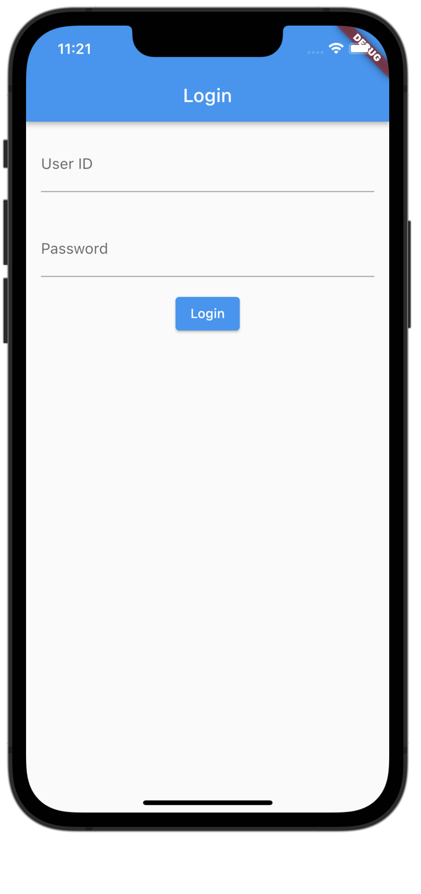
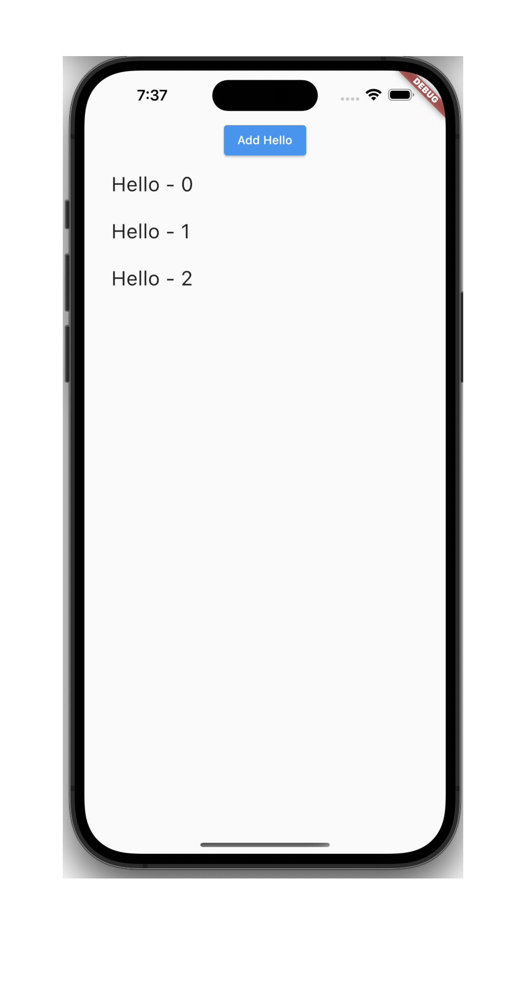
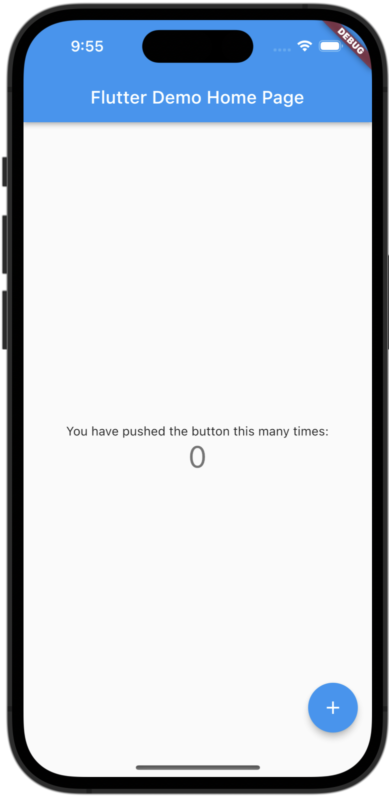
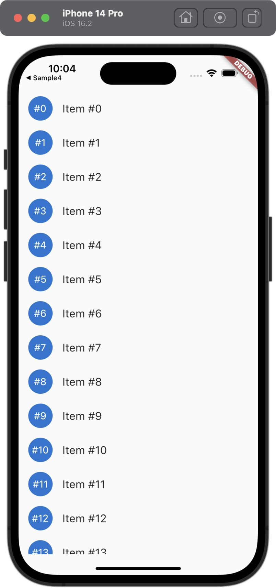

# Software Design 2022 年 11 月号~ : 連載「楽しい Flutter - しくみがわかるともっとハマる - 」

サンプルコード

## 2022 年 11 月号

### sample1

## 2022 年 12 月号

### sample2

## 2023 年 1 月号

本号にサンプルはありません

## 2023 年 2 月号

### sample4

カウンターアプリケーションを Provider で書き直したサンプルアプリケーションです。

## 2023 年 3 月号

### sample5

Column と ListView の使い分けを取り扱っています。

